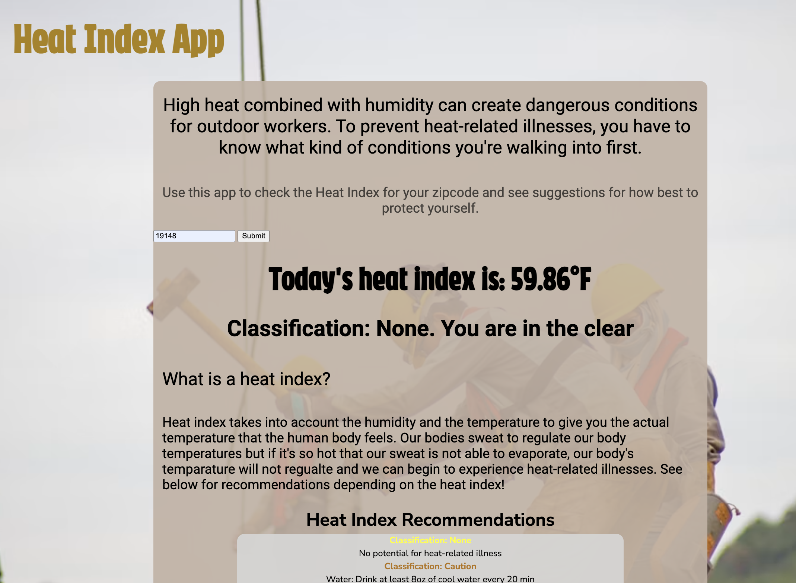

# 🏗️ Project: Simple API 1 - Construction

### Goal: Build a simple front-end app that displays data returned from an api that would be beneficial to someone in the trades (construction, hvac, plumbing, ect)

### My project: I created a Heat Index Recommendations App

### How does it work?
### - User can input a zip code to check the heat index of that area
### - User will also see the 'Classificaiton' that is awarded depending on the heat index. 
### - User can view recommendations in the chart at the bottom
